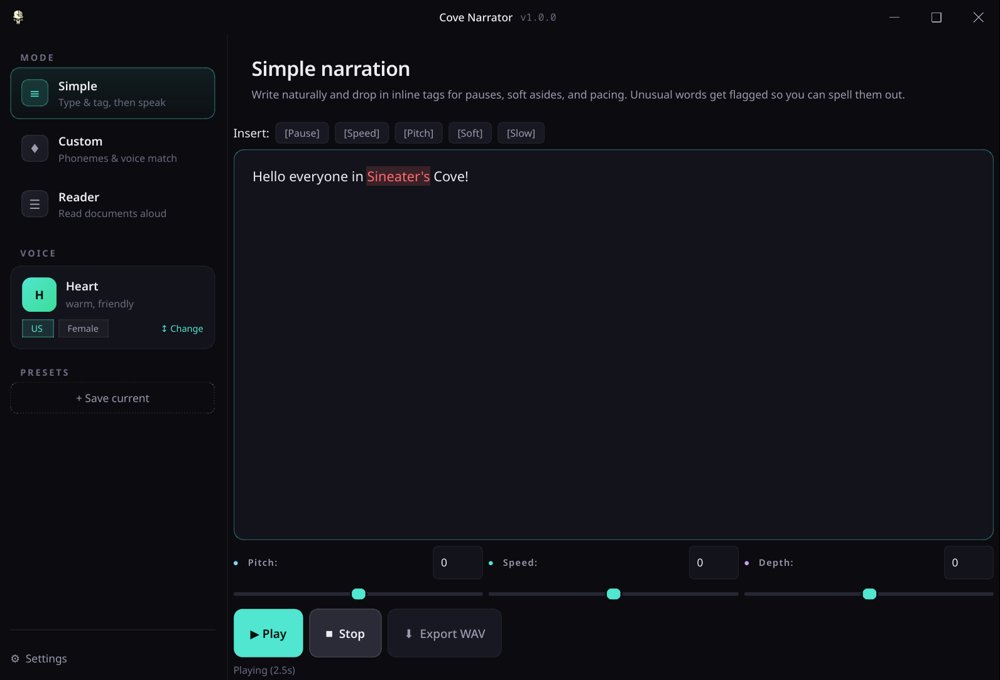

# Cove Narrator



Fully offline text-to-speech desktop app with voice blending, phoneme-level pronunciation control, voice cloning, and document reading. Built on [Kokoro ONNX](https://github.com/thewh1teagle/kokoro-onnx) with optional [Qwen3-TTS](https://huggingface.co/Qwen/Qwen3-TTS-12Hz-1.7B-Base) for HD neural cloning — all processing runs locally on your machine. No accounts, no API keys, no network required after setup.

Cross-platform: **Linux** and **Windows**. Same codebase, same features on both.

## Downloads

Pre-built releases for every platform — no Python needed:

| Platform | Format | Description |
|----------|--------|-------------|
| Windows | [Setup.exe](https://github.com/Sin213/cove-narrator/releases/latest) | Standard installer |
| Windows | [Portable.exe](https://github.com/Sin213/cove-narrator/releases/latest) | Single-file, runs from USB |
| Linux | [AppImage](https://github.com/Sin213/cove-narrator/releases/latest) | Portable, works on any distro |
| Linux | [.deb](https://github.com/Sin213/cove-narrator/releases/latest) | Debian/Ubuntu package |

All releases include `checksums-sha256.txt` for verification.

## Features

**Four modes:**

- **Simple** — Type or paste text, drop in inline tags (`[Pause]`, `[Soft]`, `[Slow]`, `[Speed]`, `[Pitch]`), hit Play. Unknown words get flagged so you can spell them out in Custom mode.
- **Custom** — Spell tricky words phonetically with ARPABET buttons. Drop a reference audio clip and Cove analyzes it, picks the closest voice blend, and sets sliders to match.
- **Reader** — Open `.txt` or `.pdf` files. Cove reads sentence by sentence with live highlighting. Click any sentence to jump. Next-sentence prefetch keeps playback seamless.
- **Clone** — Drop a voice clip or record yourself. Cove auto-analyzes the reference and finds the closest Kokoro voice blend, then auto-populates pitch/speed/depth sliders you can fine-tune. Save matched voices as presets usable across all tabs. Optional HD neural cloning via Qwen3-TTS 1.7B (4.3 GB download) for users who want closer voice similarity.

**Voice system:**

- 27 built-in voices — American and British, male and female, each with a personality description (warm, dramatic, playful, etc.)
- Voice gallery with search and region/gender filters
- **Voice blending** — Drop a reference clip and Cove finds the optimal mix of built-in voices to match its pitch (e.g. 70% Onyx + 30% Echo). Save blends by name and reuse them across sessions.
- **Voice cloning** — Analyze any voice clip to auto-match the closest Kokoro blend with tunable sliders. Save cloned voices as presets. Optional HD neural cloning for higher fidelity (separate download).

**HD Voice Clone (optional):**

- One-click install of HD dependencies (~5 GB) and Qwen3-TTS model (4.3 GB)
- Real-time download progress with percentage, ETA, and size counters
- Requires NVIDIA GPU with 4+ GB VRAM
- Works on both Linux and Windows, including portable/frozen builds

**Audio:**

- Pitch, speed, and depth sliders with color-coded pips
- WAV export (PCM 16-bit or 32-bit)
- Inline tag system for fine-grained control over pacing and emphasis
- Configurable keyboard shortcuts (Play/Pause, Stop, Export)

**Design:**

- Cove dark theme with teal accent
- Custom frameless titlebar with min/max/close controls
- Sidebar layout with mode navigation, voice card, and presets

## Requirements (from source)

- Python 3.10+
- Kokoro model files (see [Setup](#setup-from-source))
- **Linux:** PulseAudio or PipeWire for audio output
- **Windows:** No extra audio setup needed

## Setup (from source)

### Linux

```bash
git clone https://github.com/Sin213/cove-narrator.git
cd cove-narrator
python3 -m venv .venv
source .venv/bin/activate
pip install -r requirements.txt
```

### Windows

```powershell
git clone https://github.com/Sin213/cove-narrator.git
cd cove-narrator
python -m venv .venv
.venv\Scripts\activate
pip install -r requirements.txt
```

### Model files

Download the Kokoro v1.0 model files and place them in `data/models/`:

- `kokoro-v1.0.onnx` (~85 MB)
- `voices-v1.0.bin` (~53 MB)

These are required for synthesis. The app will not start without them.

## Run

### Linux

```bash
source .venv/bin/activate
python -m src.main
```

### Windows

```powershell
.venv\Scripts\activate
python -m src.main
```

## Project structure

```
cove-narrator/
  src/
    main.py              Entry point
    app.py               Main window, sidebar, voice gallery
    engine/
      tts.py             TTS synthesis (text, hybrid, raw, phonemes)
      analyzer.py        Reference audio analysis (F0, gender detection)
      audio_dsp.py       Pitch shift, depth, speed conversion
      voice_blend.py     Voice blend optimizer + custom voice storage
      clone_tts.py       Voice match engine + optional HD neural cloning
    tabs/
      simple_tab.py      Simple narration with inline tags
      custom_tab.py      Phoneme builder + reference audio matching
      reader_tab.py      Document reader with sentence tracking
      clone_tab.py       Voice cloning with auto-analysis + sliders
    utils/
      theme.py           Cove dark theme (QSS stylesheet)
      chrome.py          Custom frameless titlebar + edge resizing
      config.py          Config persistence + Whooshy migration
      presets.py          Voice preset save/load
      export.py          WAV export
      audio_player.py    Playback with pause/resume
      settings_dialog.py Settings UI
    data/
      dictionary.py      CMU dictionary + G2P fallback
      phonemes.py        ARPABET phoneme inventory
    models/
      loader.py          Model file discovery
  data/
    models/              Kokoro ONNX model + voice pack
    cmudict.txt          CMU pronunciation dictionary
  build/
    icon.png             App icon
    build.sh             Linux build script
    pyinstaller/         PyInstaller spec
    deb/                 Debian packaging notes
  tests/                 pytest test suite
```

## Config paths

| Platform | Config | Presets | Custom voices | HD deps | Exports |
|----------|--------|---------|---------------|---------|---------|
| Linux | `~/.config/cove-narrator/config.json` | `~/.config/cove-narrator/presets/` | `~/.config/cove-narrator/voices/` | `~/.local/share/cove-narrator/hd-deps/` | `~/Music/Cove Narrator/` |
| Windows | `%USERPROFILE%\.config\cove-narrator\config.json` | `%USERPROFILE%\.config\cove-narrator\presets\` | `%USERPROFILE%\.config\cove-narrator\voices\` | Next to executable | `%USERPROFILE%\Music\Cove Narrator\` |

Users upgrading from Whooshy: existing config and presets are automatically migrated on first launch.

## Keyboard shortcuts

| Action | Default | Configurable |
|--------|---------|:---:|
| Play / Pause | Space | Yes |
| Stop | Escape | Yes |
| Export WAV | Ctrl+E | Yes |

Change shortcuts in Settings (sidebar → Settings).

## Inline tags (Simple mode)

| Tag | Effect |
|-----|--------|
| `[Pause]` | 0.5s silence. `[Pause 1.5]` for custom duration |
| `[Speed 1.5]` | Speed up next segment. 0.5 = slow, 2.0 = fast |
| `[Pitch 30]` | Shift pitch. Range: -100 to 100 |
| `[Soft]` | Quieter (~40% volume) |
| `[Slow]` | Slower (0.7x speed) |

## Tests

```bash
source .venv/bin/activate
pytest
```

## License

MIT
